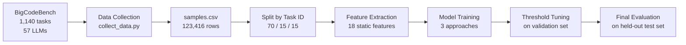
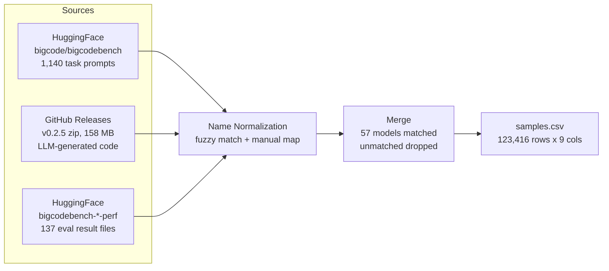

# Vibe Check: Static Defect Prediction for AI-Generated Code

Can we predict whether AI-generated code will pass its test suite without running it?

AI coding assistants now generate a large share of new code, but even top LLMs only produce correct code about 60% of the time on practical tasks. Software defect prediction (SDP) is a well-established ML subfield that uses static code features to predict bugs in human-written code. We apply this framework to LLM-generated code: extract static features from the source, train classifiers, and see whether failure patterns in AI code are predictable from the code alone.

We train on 123,000 labeled code samples across 57 LLMs using the BigCodeBench benchmark. Our best model (Logistic Regression with TF-IDF features and threshold tuning) achieves 0.645 AUC-ROC and 0.592 F1 on a held-out test set that was never used during training or tuning.


## Overall Architecture




## Repository Structure

```
.
├── main.py                          # Pipeline orchestrator
├── requirements.txt                 # Dependencies
├── data/
│   ├── raw/                         # Downloaded data (gitignored)
│   ├── clean/                       # Processed CSVs and splits (gitignored)
│   └── preprocessing/
│       ├── collect_data.py          # Downloads and merges raw data
│       └── split_data.py            # Train/val/test split by task_id
├── feature_engineering/
│   ├── feature_extraction.py        # All feature extraction functions
│   └── run_feature_extraction.py    # Runs extraction over a full CSV
├── models/
│   ├── README.md                    # Detailed model documentation
│   ├── train_baselines.py           # Majority class, random, LOC threshold
│   ├── train_baseline.py            # Static features, val-set tuning
│   ├── train_tfidf.py               # Static + TF-IDF, val-set tuning
│   ├── train_crossval.py            # Static features, GroupKFold CV tuning
│   ├── tune_threshold.py            # Decision threshold tuning (all models)
│   ├── outputs_baselines/           # Baseline comparison metrics
│   ├── outputs_baseline/            # Saved models, metrics, plots
│   ├── outputs_tfidf/               # Saved models, metrics, plots
│   └── outputs_crossval/            # Saved models, metrics, plots
└── archive/                         # Exploratory notebooks and deprecated files
```


## Evaluation Protocol

All hyperparameter tuning and threshold selection is done on the validation set. The test set is used exactly once per model for final evaluation. This strict separation prevents data snooping and ensures reported metrics reflect true out-of-sample performance.

- **Train** (70%, 798 tasks, ~86K samples): model fitting and cross-validation
- **Validation** (15%, 171 tasks, ~18.5K samples): hyperparameter selection and threshold tuning
- **Test** (15%, 171 tasks, ~18.5K samples): final evaluation only, never seen during any tuning

The split is by task_id so the same programming problem never appears in multiple sets. This forces models to learn general code quality signals rather than memorizing task-specific patterns.


## Data

We use BigCodeBench (Zhuo et al., 2024), hosted on HuggingFace and GitHub under the Apache 2.0 license. The dataset pairs 1,140 Python programming tasks (each with a prompt, canonical solution, and test suite covering 99% branch coverage) with code generated by 57 LLMs. Each sample is labeled pass (1) or fail (0) based on execution against the test suite.

The final dataset has 123,416 rows with a 41% overall pass rate. Pass rates vary by model (GPT-4o at 53%, Mistral-7B at 23%) and by prompt format (45% for complete-style prompts, 37% for instruct-style).

| Column | Description |
|---|---|
| task_id | Task identifier, e.g. BigCodeBench/0 |
| model_name | LLM that generated the code |
| split | Prompt format: complete or instruct |
| solution | The generated Python code |
| label | 1 = passed all tests, 0 = failed |
| complete_prompt | Long docstring-style prompt |
| instruct_prompt | Short natural language instruction |
| libs | Required libraries for the task |
| entry_point | Function name being tested |

The dataset is hosted privately on HuggingFace at `Vihaan8/bigcodebench-sdp`.


## Data Collection and Preprocessing

`data/preprocessing/collect_data.py` assembles the dataset from three sources, then merges them into a single CSV.



Matching samples to their labels was the main challenge. The code sample files use full HuggingFace model IDs (e.g. `codellama--CodeLlama-7b-Instruct-hf`) while the eval results use display names (e.g. `CodeLlama_7B_Instruct`). We handle this with fuzzy normalization (strip org prefix, `-hf` suffix, separators) plus a manual mapping dict for edge cases like version tags and API date stamps. Models that can't be matched are dropped, mostly base (non-instruction-tuned) models that have eval results but no sample files.


## Feature Engineering

`feature_engineering/feature_extraction.py` extracts 18 static features from each code sample organized into four groups, each targeting a different hypothesis about why AI code fails.


**Classical software metrics** (3 features): `classical_loc`, `classical_cyclomatic_complexity`, `classical_max_nesting_depth`

**AST structural features** (8 features): `ast_if_count`, `ast_for_count`, `ast_while_count`, `ast_try_count`, `ast_except_count`, `ast_return_count`, `ast_import_count`, `ast_has_error_handling`

**Prompt-code alignment features** (3 features): We parse the actual `libs` column from BigCodeBench (which lists required libraries per task) and compare against what the code imports. `align_lib_coverage`, `align_missing_libs`, `align_length_ratio`

**LLM smell features** (4 features): `smell_hardcoded_return_funcs`, `smell_placeholder_hits` (pass, ..., raise NotImplementedError, TODO/FIXME), `smell_is_very_short`, `smell_relative_length` (LOC / median LOC for that task, computed per-split)

A diagnostic field `meta_parse_error` is also extracted but excluded from model training since all sanitized samples parse successfully.


## Results

### Baselines (no learning)

| Baseline | AUC-ROC | F1 | Accuracy |
|---|---|---|---|
| Majority class (always predict fail) | 0.500 | 0.000 | 0.588 |
| Random stratified | 0.503 | 0.405 | 0.514 |
| Code length > task median | 0.385 | 0.362 | 0.425 |
| LOC threshold (>8 lines) | 0.385 | 0.526 | 0.384 |

### Learned models (default threshold 0.5)

| Approach | Model | AUC-ROC | F1 | Accuracy |
|---|---|---|---|---|
| Baseline (static) | Logistic Regression | 0.616 | 0.546 | 0.572 |
| Baseline (static) | LightGBM | 0.629 | 0.544 | 0.593 |
| TF-IDF | Logistic Regression | **0.645** | 0.549 | 0.602 |
| TF-IDF | LightGBM | 0.636 | 0.539 | 0.612 |
| TF-IDF | Random Forest | 0.620 | 0.546 | 0.592 |
| Crossval | Logistic Regression | 0.622 | 0.543 | 0.573 |
| Crossval | XGBoost | 0.629 | 0.356 | 0.619 |

### With threshold tuning (tuned on validation set, evaluated on test)

| Model | Tuned Threshold | AUC-ROC | F1 | Accuracy |
|---|---|---|---|---|
| **LogReg + TF-IDF** | **0.39** | **0.645** | **0.592** | 0.529 |
| XGBoost (crossval) | 0.29 | 0.629 | 0.585 | 0.497 |
| LogReg (crossval) | 0.36 | 0.622 | 0.587 | 0.484 |

Our best result is Logistic Regression with TF-IDF features and threshold tuned to 0.39: **0.645 AUC-ROC, 0.592 F1**.

### Why accuracy drops with threshold tuning

Lowering the threshold from 0.5 to 0.39 means the model predicts "pass" more aggressively. This catches more true passes (higher recall, higher F1) but also produces more false positives, which drops raw accuracy from 0.602 to 0.529. This is an intentional tradeoff: in practice, flagging potential failures for review is more useful than maximizing the percentage of correct predictions. F1 balances precision and recall and is a better metric than accuracy for this imbalanced dataset (41% pass / 59% fail).

### Why the AUC ceiling is around 0.65

Our failure analysis revealed that passing and failing code are structurally almost identical, differing by only ~96 characters and 1.6 lines on average. The strongest signal in the data is task difficulty: 153 tasks have a 0% pass rate across all 57 models, and strong and weak models fail on 77% of the same tasks. Static features capture "how hard is this task" more than "is this specific code correct." Two code samples can have identical complexity, imports, and structure but differ by a single method call (.mean() vs .sum()), and static features cannot see that difference. This is a fundamentally different failure mode from human-written code, where complexity and code churn are stronger bug predictors.


## How to Run

Install dependencies:

```bash
python -m pip install -r requirements.txt
```

The `main.py` script orchestrates the pipeline:

```bash
python main.py --all                           # full pipeline from scratch
python main.py                                 # train all models (default)
python main.py --preprocess                    # download data and split
python main.py --features                      # extract features from splits
python main.py --models baselines              # majority class, random, LOC threshold
python main.py --models baseline               # static features, val-set tuning
python main.py --models tfidf                  # static + TF-IDF, val-set tuning
python main.py --models crossval               # static features, GroupKFold CV
python main.py --models threshold              # tune thresholds on all trained models
python main.py --models crossval threshold     # train crossval then tune thresholds
```

Or run each script directly:

```bash
python data/preprocessing/collect_data.py
python data/preprocessing/split_data.py --input data/clean/samples.csv --outdir data/clean/splits
python feature_engineering/run_feature_extraction.py --input data/clean/splits/train.csv --out data/clean/splits/train_features.csv
python models/train_baselines.py
python models/train_baseline.py
python models/train_tfidf.py
python models/train_crossval.py
python models/tune_threshold.py
```


## Team

Jordan Andrew, Vihaan Manchanda, Yuqian Wang, Qingyu "Grace" Yang, Xihan "Patrick" Zhu

IDS 705, Duke University


## References

Zhuo, T. Y., Vu, M. C., Chim, J., et al. (2024). BigCodeBench: Benchmarking Code Generation with Diverse Function Calls and Complex Instructions. ICLR 2025.
