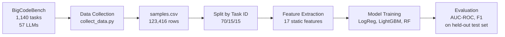
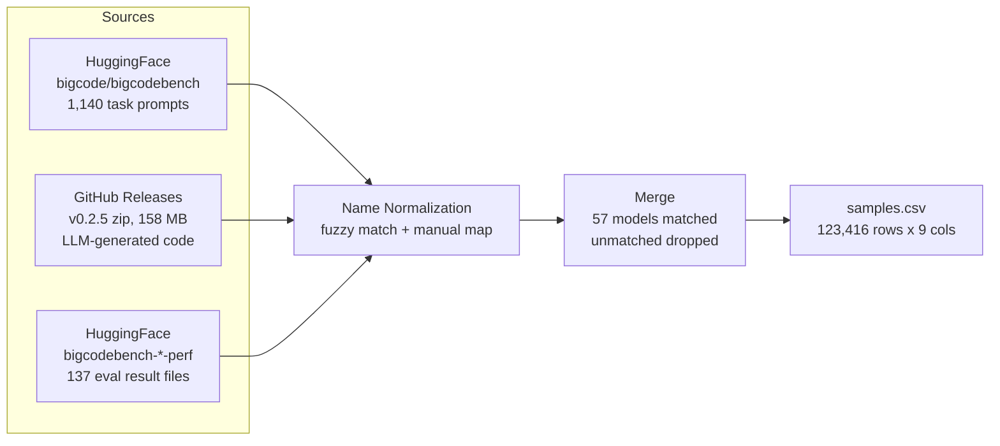
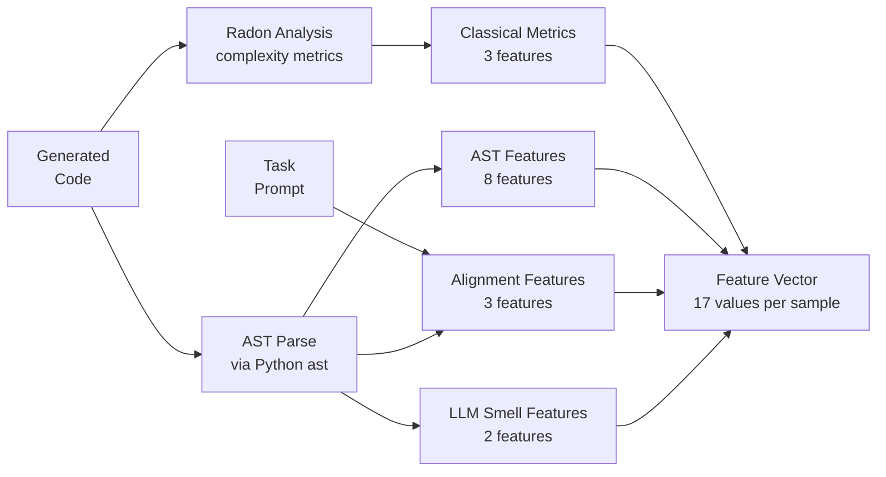
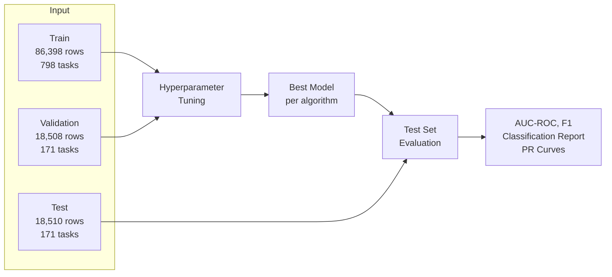

# Vibe Check: Static Defect Prediction for AI-Generated Code

Can we predict whether AI-generated code will pass its test suite without running it?

AI coding assistants now generate a large share of new code, but even top LLMs only produce correct code about 60% of the time on practical tasks. Software defect prediction (SDP) is a well-established ML subfield that uses static code features to predict bugs in human-written code. We apply this framework to LLM-generated code: extract static features from the source, train classifiers, and see whether failure patterns in AI code are predictable from the code alone.

We train on 123,000 labeled code samples across 57 LLMs using the BigCodeBench benchmark. The best model (Logistic Regression with TF-IDF features) achieves 0.635 AUC-ROC on a held-out test set, showing that static code properties carry meaningful signal about correctness.


## Overall Architecture




## Repository Structure

```
.
├── main.py                          # Pipeline orchestrator
├── data/
│   ├── raw/                         # Downloaded data (gitignored)
│   ├── clean/                       # Processed CSVs and splits (gitignored)
│   └── preprocessing/
│       ├── collect_data.py          # Downloads and merges raw data
│       └── split_data.py            # Train/val/test split by task_id
├── feature_engineering/
│   ├── feature_extraction.py        # All feature extraction functions
│   └── run_feature_extraction.py    # Runs extraction over a full CSV
├── models/
│   ├── README.md                    # Detailed model documentation
│   ├── train_models_v1.py           # Static features only
│   ├── train_models_v2.py           # Static + TF-IDF features
│   ├── outputs_v1/                  # Saved models, metrics, plots (v1)
│   └── outputs_v2/                  # Saved models, metrics, plots (v2)
└── archive/                         # Exploratory notebooks and deprecated files
```


## Data

We use BigCodeBench (Zhuo et al., 2024), hosted on HuggingFace and GitHub under the Apache 2.0 license. The dataset pairs 1,140 Python programming tasks (each with a prompt, canonical solution, and test suite covering 99% branch coverage) with code generated by 57 LLMs. Each sample is labeled pass (1) or fail (0) based on execution against the test suite.

The final dataset has 123,416 rows with a 41% overall pass rate. Pass rates vary by model (GPT-4o at 53%, Mistral-7B at 23%) and by prompt format (45% for complete-style prompts, 37% for instruct-style).

| Column | Description |
|---|---|
| task_id | Task identifier, e.g. BigCodeBench/0 |
| model_name | LLM that generated the code |
| split | Prompt format: complete or instruct |
| solution | The generated Python code |
| label | 1 = passed all tests, 0 = failed |
| complete_prompt | Long docstring-style prompt |
| instruct_prompt | Short natural language instruction |
| libs | Required libraries for the task |
| entry_point | Function name being tested |

The dataset is hosted privately on HuggingFace at `Vihaan8/bigcodebench-sdp`.


## Data Collection and Preprocessing

`data/preprocessing/collect_data.py` assembles the dataset from three sources, then merges them into a single CSV.



Matching samples to their labels was the main challenge. The code sample files use full HuggingFace model IDs (e.g. `codellama--CodeLlama-7b-Instruct-hf`) while the eval results use display names (e.g. `CodeLlama_7B_Instruct`). We handle this with fuzzy normalization (strip org prefix, `-hf` suffix, separators) plus a manual mapping dict for edge cases like version tags and API date stamps. Models that can't be matched are dropped, mostly base (non-instruction-tuned) models that have eval results but no sample files.

`data/preprocessing/split_data.py` splits the dataset into train (70%), validation (15%), and test (15%) grouped by task_id. This ensures the same programming problem never appears in both train and test, forcing the models to learn general code quality signals rather than memorizing task-specific patterns.


## Feature Engineering

`feature_engineering/feature_extraction.py` extracts 17 static features from each code sample organized into four groups, each targeting a different hypothesis about why AI code fails.



**Classical software metrics** (3 features) measure code complexity using radon and Python's ast module:
- `classical_loc` (source lines of code), `classical_cyclomatic_complexity` (number of independent paths), `classical_max_nesting_depth` (deepest control-flow nesting)

**AST structural features** (8 features) count key node types in the abstract syntax tree:
- `ast_if_count`, `ast_for_count`, `ast_while_count`, `ast_try_count`, `ast_except_count`, `ast_return_count`, `ast_import_count`, `ast_has_error_handling`

**Prompt-code alignment features** (3 features) check whether the generated code addresses what was asked. These are specific to the LLM setting and have no equivalent in traditional SDP:
- `align_lib_coverage` (fraction of prompt-mentioned libraries imported), `align_missing_libs` (count of missing libraries), `align_length_ratio` (code length relative to prompt length)

**LLM smell features** (2 features) target known failure modes of code generators:
- `smell_hardcoded_return_funcs` (functions whose body is just `return <literal>`), `smell_is_very_short` (5 or fewer non-blank lines)

Plus one meta feature: `meta_parse_error` (1 if the code has a syntax error and can't be parsed).

The features most correlated with failure are lines of code (-0.17), presence of error handling (-0.12), and cyclomatic complexity (-0.12). The negative correlation means that as solutions grow longer and more complex, they are more likely to fail. This suggests LLMs struggle primarily with task complexity: simple tasks get correct short answers, while harder tasks produce longer but incorrect code.

Prompt-code alignment features show near-zero correlation, indicating that simple heuristic alignment is not enough to capture whether generated code satisfies the prompt.


## Model Training and Evaluation

We frame this as binary classification: does a given code sample pass or fail its test suite? Hyperparameters are tuned on the validation set only. The test set is used once for final evaluation.



Two model versions were trained. See `models/README.md` for full details including hyperparameter grids and per-class metrics.

### Version 1: Static features only

Logistic Regression and LightGBM trained on the 17 hand-crafted features.

| Model | AUC-ROC | F1 | Accuracy |
|---|---|---|---|
| Logistic Regression | 0.604 | 0.538 | 0.561 |
| LightGBM | 0.608 | 0.516 | 0.582 |

### Version 2: Static + TF-IDF features

Adds 20,000 TF-IDF features (10K word n-grams + 10K character n-grams) extracted from the raw code text, giving models access to actual code tokens rather than just summary statistics.

| Model | Features | AUC-ROC | F1 | Accuracy |
|---|---|---|---|---|
| Logistic Regression | Static + TF-IDF (20,017) | 0.635 | 0.537 | 0.592 |
| LightGBM | Static + TF-IDF (20,017) | 0.634 | 0.529 | 0.611 |
| Random Forest | Static only (17) | 0.605 | 0.537 | 0.581 |

Adding TF-IDF improved AUC by about 0.03 for Logistic Regression and LightGBM. Random Forest uses only the 17 static features because RF on 20K sparse columns is prohibitively slow.

All models handle the 41/59 class imbalance through class weighting (balanced class weights for LogReg and RF, scale_pos_weight for LightGBM). We report AUC-ROC and F1 rather than accuracy, since accuracy is misleading on imbalanced datasets.

### Key findings

The TF-IDF features help because they capture patterns the static features miss: specific function names, import patterns, and syntax constructs that correlate with pass/fail. However, the overall AUC ceiling around 0.635 suggests that purely static features (even with TF-IDF) have limited predictive power for this task. The signal is real but modest.

Grace's exploratory analysis (in `archive/grace_model.ipynb`) also evaluated XGBoost with hyperparameter tuning via StratifiedGroupKFold cross-validation. The tuned XGBoost achieved 0.640 AUC but only 0.329 F1 due to very low recall for the positive class. Logistic Regression was selected as the final model because it delivered the best balance of AUC, F1, and stability across train/validation/test.


## How to Run

Install dependencies:

```bash
pip install pandas numpy radon scikit-learn lightgbm shap matplotlib scipy datasets requests tqdm
```

The `main.py` script orchestrates the pipeline:

```bash
python main.py --all                  # full pipeline from scratch
python main.py                        # train all models (default, assumes data exists)
python main.py --preprocess           # download data and split
python main.py --features             # extract features from splits
python main.py --models v1            # train v1 only (static features)
python main.py --models v2            # train v2 only (static + TF-IDF)
```

Or run each script directly:

```bash
python data/preprocessing/collect_data.py
python data/preprocessing/split_data.py --input data/clean/samples.csv --outdir data/clean/splits
python feature_engineering/run_feature_extraction.py --input data/clean/splits/train.csv --out data/clean/splits/train_features.csv
python models/train_models_v1.py
python models/train_models_v2.py
```


## Team

Jordan Andrew, Vihaan Manchanda, Yuqian Wang, Qingyu "Grace" Yang, Xihan "Patrick" Zhu

IDS 705, Duke University


## References

Zhuo, T. Y., Vu, M. C., Chim, J., et al. (2024). BigCodeBench: Benchmarking Code Generation with Diverse Function Calls and Complex Instructions. ICLR 2025.
