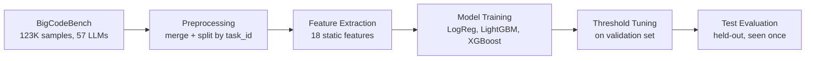
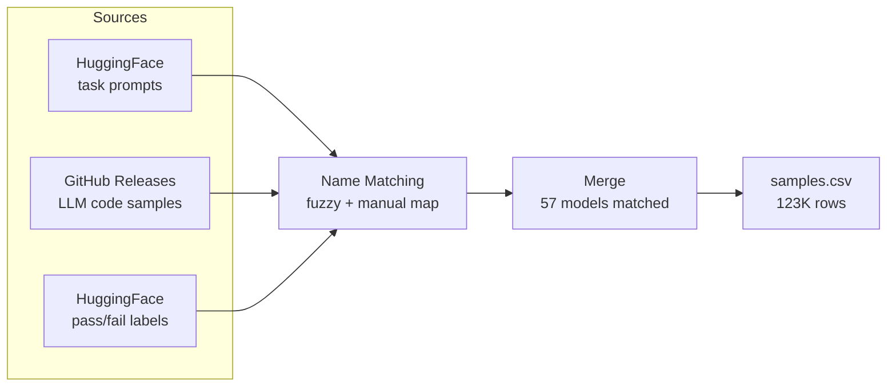
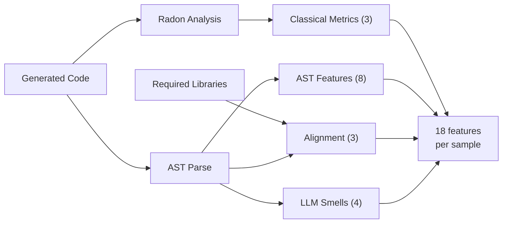

# Vibe Check: Static Defect Prediction for AI-Generated Code

Can we predict whether AI-generated code will pass its test suite without running it?

AI coding assistants now generate a large share of new code, but even top LLMs only produce correct code about 60% of the time on practical tasks. Software defect prediction (SDP) is a well-established ML subfield that uses static code features to predict bugs in human-written code. We apply this framework to LLM-generated code: extract static features from the source, train classifiers, and see whether failure patterns in AI code are predictable from the code alone.

We train on 123,000 labeled code samples across 57 LLMs using the BigCodeBench benchmark. Our best model (Logistic Regression with TF-IDF features and threshold tuning) achieves 0.645 AUC-ROC and 0.592 F1 on a held-out test set that was never used during training or tuning.


## Repository Structure

```
.
├── main.py                          # Pipeline orchestrator
├── requirements.txt                 # Dependencies
├── data/
│   ├── raw/                         # Downloaded data (gitignored)
│   ├── clean/                       # Processed CSVs and splits (gitignored)
│   └── preprocessing/
│       ├── collect_data.py          # Downloads and merges raw data
│       └── split_data.py            # Train/val/test split by task_id
├── feature_engineering/
│   ├── feature_extraction.py        # All feature extraction functions
│   └── run_feature_extraction.py    # Runs extraction over a full CSV
├── models/
│   ├── README.md                    # Detailed model documentation
│   ├── train_baselines.py           # Majority class, random, LOC threshold
│   ├── train_baseline.py            # Static features, val-set tuning
│   ├── train_tfidf.py               # Static + TF-IDF, val-set tuning
│   ├── train_crossval.py            # Static features, GroupKFold CV tuning
│   ├── tune_threshold.py            # Decision threshold tuning (all models)
│   ├── outputs_baselines/           # Baseline comparison metrics
│   ├── outputs_baseline/            # Saved models, metrics, plots
│   ├── outputs_tfidf/               # Saved models, metrics, plots
│   └── outputs_crossval/            # Saved models, metrics, plots
└── archive/                         # Exploratory notebooks and deprecated files
```


## How to Run

Install dependencies:

```bash
python -m pip install -r requirements.txt
```

The `main.py` script orchestrates the pipeline:

```bash
python main.py --all                           # full pipeline from scratch
python main.py                                 # train all models (default)
python main.py --preprocess                    # download data and split
python main.py --features                      # extract features from splits
python main.py --models baselines              # majority class, random, LOC threshold
python main.py --models baseline               # static features, val-set tuning
python main.py --models tfidf                  # static + TF-IDF, val-set tuning
python main.py --models crossval               # static features, GroupKFold CV
python main.py --models threshold              # tune thresholds on all trained models
python main.py --models crossval threshold     # train crossval then tune thresholds
```

Or run each script directly:

```bash
python data/preprocessing/collect_data.py
python data/preprocessing/split_data.py --input data/clean/samples.csv --outdir data/clean/splits
python feature_engineering/run_feature_extraction.py --input data/clean/splits/train.csv --out data/clean/splits/train_features.csv
python models/train_baselines.py
python models/train_baseline.py
python models/train_tfidf.py
python models/train_crossval.py
python models/tune_threshold.py
```


## Overall Architecture




## Evaluation Protocol

All hyperparameter tuning and threshold selection is done on the validation set. The test set is used exactly once per model for final evaluation. This strict separation prevents data snooping and ensures reported metrics reflect true out-of-sample performance.

| Split | Tasks | Samples | Purpose |
|---|---|---|---|
| Train | 798 | ~86,400 | Model fitting and cross-validation |
| Validation | 171 | ~18,500 | Hyperparameter selection and threshold tuning |
| Test | 171 | ~18,500 | Final evaluation only, never seen during tuning |

The split is by task_id so the same programming problem never appears in multiple sets.


## Data

We use BigCodeBench (Zhuo et al., 2024). The dataset pairs 1,140 Python programming tasks (each with a prompt, canonical solution, and test suite at 99% branch coverage) with code generated by 57 LLMs. Each sample is labeled pass (1) or fail (0) based on execution against the test suite.

| Statistic | Value |
|---|---|
| Total samples | 123,416 |
| Unique models | 57 |
| Unique tasks | 1,140 |
| Overall pass rate | 41.2% |
| Complete prompt pass rate | 45.5% |
| Instruct prompt pass rate | 36.5% |
| Best model (DeepSeek Coder V2) | 54.0% pass |
| Worst model (Mistral 7B v0.3) | 23.4% pass |

| Column | Description |
|---|---|
| task_id | Task identifier, e.g. BigCodeBench/0 |
| model_name | LLM that generated the code |
| split | Prompt format: complete or instruct |
| solution | The generated Python code |
| label | 1 = passed all tests, 0 = failed |
| complete_prompt | Long docstring-style prompt |
| instruct_prompt | Short natural language instruction |
| libs | Required libraries for the task |
| entry_point | Function name being tested |


## Data Collection and Preprocessing



`data/preprocessing/collect_data.py` downloads task prompts, LLM-generated code, and evaluation results from BigCodeBench. The main challenge was matching sample filenames to evaluation labels, since they use different naming conventions (e.g. `codellama--CodeLlama-7b-Instruct-hf` vs `CodeLlama_7B_Instruct`). We use fuzzy normalization plus a manual mapping for edge cases.

`data/preprocessing/split_data.py` splits the dataset 70/15/15 grouped by task_id.


## Feature Engineering



We extract 18 static features per code sample, organized into four groups. Each group targets a different hypothesis about why AI code fails.

### Feature reference

| Feature | Group | Description |
|---|---|---|
| `classical_loc` | Classical | Source lines of code (non-blank, non-comment) |
| `classical_cyclomatic_complexity` | Classical | Number of independent execution paths |
| `classical_max_nesting_depth` | Classical | Deepest level of nested control flow |
| `ast_if_count` | AST | Number of if statements |
| `ast_for_count` | AST | Number of for loops |
| `ast_while_count` | AST | Number of while loops |
| `ast_try_count` | AST | Number of try blocks |
| `ast_except_count` | AST | Number of except handlers |
| `ast_return_count` | AST | Number of return statements |
| `ast_import_count` | AST | Number of import statements |
| `ast_has_error_handling` | AST | 1 if any try/except exists, 0 otherwise |
| `align_lib_coverage` | Alignment | Fraction of required libraries actually imported |
| `align_missing_libs` | Alignment | Count of required libraries not imported |
| `align_length_ratio` | Alignment | Code length / prompt length |
| `smell_hardcoded_return_funcs` | LLM Smell | Functions whose body is just `return <literal>` |
| `smell_placeholder_hits` | LLM Smell | Count of `pass`, `...`, `raise NotImplementedError`, TODO |
| `smell_is_very_short` | LLM Smell | 1 if 5 or fewer non-blank lines |
| `smell_relative_length` | LLM Smell | LOC / median LOC for that task (per-split) |

Alignment features use the actual `libs` column from BigCodeBench rather than scanning prompt text. `meta_parse_error` is also extracted but excluded from training since all sanitized samples parse successfully.

### Feature correlation with label

| Feature | Correlation | Direction |
|---|---|---|
| `classical_loc` | -0.188 | Longer code fails more |
| `ast_import_count` | -0.120 | More imports = harder task |
| `ast_if_count` | -0.104 | More branching = more failure |
| `classical_cyclomatic_complexity` | -0.099 | More complex = more failure |
| `ast_return_count` | -0.055 | More returns = more failure |
| `smell_is_very_short` | -0.050 | Trivially short code fails |
| `align_lib_coverage` | -0.007 | Near-zero signal |
| `align_missing_libs` | +0.002 | Near-zero signal |

All strong correlations are negative. As code grows longer and more complex, it is more likely to fail. This reflects task difficulty rather than code quality: harder tasks produce longer code from all models.


## Results

### Baselines

Simple heuristics to confirm that learned models add value beyond trivial rules.

| Baseline | AUC-ROC | F1 | Accuracy |
|---|---|---|---|
| Majority class (always predict fail) | 0.500 | 0.000 | 0.588 |
| Random stratified | 0.503 | 0.405 | 0.514 |
| Code length > task median | 0.385 | 0.362 | 0.425 |
| LOC threshold (>8 lines) | 0.385 | 0.526 | 0.384 |

All learned models beat every baseline on AUC.

### Learned models at default threshold (0.5)

| Approach | Model | AUC-ROC | F1 | Accuracy |
|---|---|---|---|---|
| Baseline (18 static) | Logistic Regression | 0.616 | 0.546 | 0.572 |
| Baseline (18 static) | LightGBM | 0.629 | 0.544 | 0.593 |
| TF-IDF (18 static + 20K text) | Logistic Regression | **0.645** | 0.549 | 0.602 |
| TF-IDF (18 static + 20K text) | LightGBM | 0.636 | 0.539 | 0.612 |
| Crossval (18 static) | Logistic Regression | 0.622 | 0.543 | 0.573 |
| Crossval (18 static) | XGBoost | 0.629 | 0.356 | 0.619 |

### With threshold tuning (selected on validation, evaluated on test)

Threshold tuning had a bigger impact on F1 than switching between model architectures. The default 0.5 threshold is a poor fit for our 41/59 class split — tuning on the validation set recovered substantial F1 for every model.

| Model | Threshold | AUC-ROC | F1 | Accuracy |
|---|---|---|---|---|
| **LogReg + TF-IDF** | **0.39** | **0.645** | **0.592** | 0.529 |
| XGBoost (crossval) | 0.29 | 0.629 | 0.585 | 0.497 |
| LogReg (crossval) | 0.36 | 0.622 | 0.587 | 0.484 |
| LightGBM + TF-IDF | 0.38 | 0.636 | 0.580 | 0.533 |

Lowering the threshold means the model predicts "pass" more aggressively. This catches more true passes (higher recall, higher F1) but produces more false positives, dropping raw accuracy. This is intentional — for a triage tool, it's better to flag more code for review than to miss real failures. F1 balances precision and recall and is a better metric than accuracy for this imbalanced dataset. A majority-class baseline gets 58.8% accuracy but 0.0 F1.

### Why the AUC ceiling is around 0.65

The strongest signal in the data is task difficulty, not code quality. Passing and failing AI-generated code are structurally near-identical — differing by about 96 characters and 1.6 lines on average. Two solutions can have the same imports, the same control flow, the same complexity, and differ only in a single method call (`.mean()` vs `.sum()`), and no static feature can see that.

| Finding | Detail |
|---|---|
| Average difference between passing and failing code | ~96 characters, ~1.6 lines |
| Tasks where all 57 models fail | 153 (13.4% of tasks) |
| Tasks where prediction matters (10-90% pass rate) | 719 (63.1% of tasks) |
| Failure overlap between top-5 and bottom-5 models | 77.3% of the same tasks |
| Hardest library domain (socket) | 13.9% pass rate |
| Easiest library domain (functools) | 77.9% pass rate |

Strong and weak models fail on 77% of the same tasks. Our features end up predicting "how hard is this task" more than "is this specific code correct." In classical SDP on human-written code, static features achieve 0.70-0.80 AUC — complexity and code churn are much stronger bug predictors there. Our 0.645 on AI code reflects a fundamentally harder problem where failures are semantic, not structural.


## Team

Vihaan Manchanda, Jordan Andrew, Qingyu "Grace" Yang, Xihan "Patrick" Zhu, Yuqian Wang

IDS 705, Duke University


## References

Zhuo, T. Y., Vu, M. C., Chim, J., et al. (2024). BigCodeBench: Benchmarking Code Generation with Diverse Function Calls and Complex Instructions. ICLR 2025.
