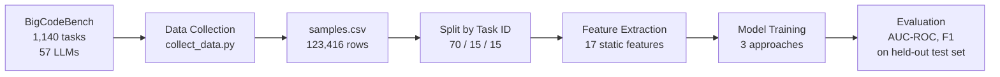
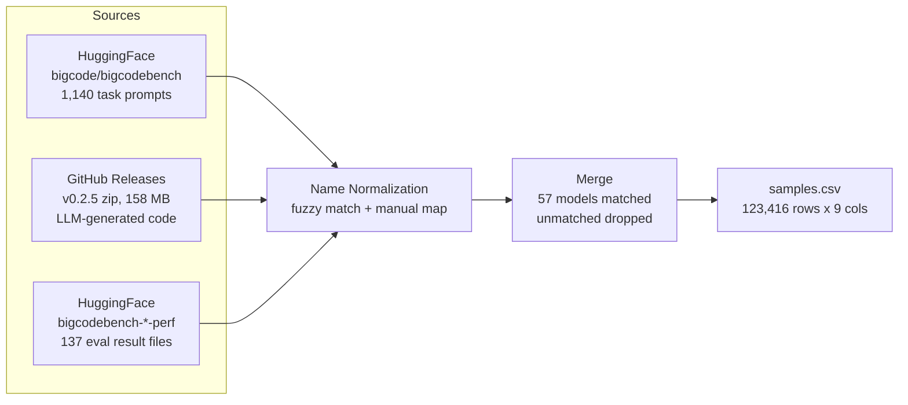
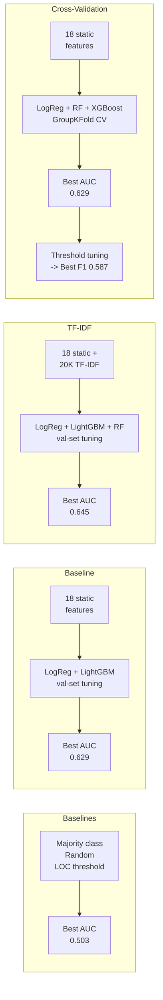

# Vibe Check: Static Defect Prediction for AI-Generated Code

Can we predict whether AI-generated code will pass its test suite without running it?

AI coding assistants now generate a large share of new code, but even top LLMs only produce correct code about 60% of the time on practical tasks. Software defect prediction (SDP) is a well-established ML subfield that uses static code features to predict bugs in human-written code. We apply this framework to LLM-generated code: extract static features from the source, train classifiers, and see whether failure patterns in AI code are predictable from the code alone.

We train on 123,000 labeled code samples across 57 LLMs using the BigCodeBench benchmark. The best model (Logistic Regression with TF-IDF features) achieves 0.645 AUC-ROC on a held-out test set, beating all simple baselines and showing that static code properties carry meaningful signal about correctness.


## Overall Architecture




## Repository Structure

```
.
├── main.py                          # Pipeline orchestrator
├── requirements.txt                 # Dependencies
├── data/
│   ├── raw/                         # Downloaded data (gitignored)
│   ├── clean/                       # Processed CSVs and splits (gitignored)
│   └── preprocessing/
│       ├── collect_data.py          # Downloads and merges raw data
│       └── split_data.py            # Train/val/test split by task_id
├── feature_engineering/
│   ├── feature_extraction.py        # All feature extraction functions
│   └── run_feature_extraction.py    # Runs extraction over a full CSV
├── models/
│   ├── README.md                    # Detailed model documentation
│   ├── train_baselines.py           # Majority class, random, LOC threshold
│   ├── train_baseline.py            # Static features, val-set tuning
│   ├── train_tfidf.py               # Static + TF-IDF, val-set tuning
│   ├── train_crossval.py            # Static features, GroupKFold CV tuning
│   ├── tune_threshold.py            # Decision threshold tuning for crossval models
│   ├── outputs_baselines/           # Baseline comparison metrics
│   ├── outputs_baseline/            # Saved models, metrics, plots
│   ├── outputs_tfidf/               # Saved models, metrics, plots
│   └── outputs_crossval/            # Saved models, metrics, plots, tuned results
└── archive/                         # Exploratory notebooks and deprecated files
```


## Data

We use BigCodeBench (Zhuo et al., 2024), hosted on HuggingFace and GitHub under the Apache 2.0 license. The dataset pairs 1,140 Python programming tasks (each with a prompt, canonical solution, and test suite covering 99% branch coverage) with code generated by 57 LLMs. Each sample is labeled pass (1) or fail (0) based on execution against the test suite.

The final dataset has 123,416 rows with a 41% overall pass rate. Pass rates vary by model (GPT-4o at 53%, Mistral-7B at 23%) and by prompt format (45% for complete-style prompts, 37% for instruct-style).

| Column | Description |
|---|---|
| task_id | Task identifier, e.g. BigCodeBench/0 |
| model_name | LLM that generated the code |
| split | Prompt format: complete or instruct |
| solution | The generated Python code |
| label | 1 = passed all tests, 0 = failed |
| complete_prompt | Long docstring-style prompt |
| instruct_prompt | Short natural language instruction |
| libs | Required libraries for the task |
| entry_point | Function name being tested |

The dataset is hosted privately on HuggingFace at `Vihaan8/bigcodebench-sdp`.


## Data Collection and Preprocessing

`data/preprocessing/collect_data.py` assembles the dataset from three sources, then merges them into a single CSV.



Matching samples to their labels was the main challenge. The code sample files use full HuggingFace model IDs (e.g. `codellama--CodeLlama-7b-Instruct-hf`) while the eval results use display names (e.g. `CodeLlama_7B_Instruct`). We handle this with fuzzy normalization (strip org prefix, `-hf` suffix, separators) plus a manual mapping dict for edge cases like version tags and API date stamps. Models that can't be matched are dropped, mostly base (non-instruction-tuned) models that have eval results but no sample files.

`data/preprocessing/split_data.py` splits the dataset into train (70%), validation (15%), and test (15%) grouped by task_id. This ensures the same programming problem never appears in both train and test, forcing the models to learn general code quality signals rather than memorizing task-specific patterns.


## Feature Engineering

`feature_engineering/feature_extraction.py` extracts 18 static features from each code sample organized into four groups, each targeting a different hypothesis about why AI code fails.


**Classical software metrics** (3 features) measure code complexity using radon and Python's ast module:
- `classical_loc` (source lines of code), `classical_cyclomatic_complexity` (number of independent paths), `classical_max_nesting_depth` (deepest control-flow nesting)

**AST structural features** (8 features) count key node types in the abstract syntax tree:
- `ast_if_count`, `ast_for_count`, `ast_while_count`, `ast_try_count`, `ast_except_count`, `ast_return_count`, `ast_import_count`, `ast_has_error_handling`

**Prompt-code alignment features** (3 features) check whether the generated code uses the libraries the task requires. We parse the `libs` column from BigCodeBench (which lists the exact required libraries for each task) and compare against what the code actually imports:
- `align_lib_coverage` (fraction of required libraries imported), `align_missing_libs` (count of required libraries not imported), `align_length_ratio` (code length relative to prompt length)

**LLM smell features** (4 features) target known failure modes of code generators:
- `smell_hardcoded_return_funcs` (functions whose body is just `return <literal>`), `smell_placeholder_hits` (count of `pass`, `...`, `raise NotImplementedError`, and TODO/FIXME comments), `smell_is_very_short` (5 or fewer non-blank lines), `smell_relative_length` (LOC / median LOC for that task, computed per-split to avoid leakage)

A diagnostic field `meta_parse_error` is also extracted (1 if code has a syntax error) but excluded from model training since BigCodeBench's sanitized samples are all parseable.


## Model Training and Evaluation

We frame this as binary classification: does a given code sample pass or fail its test suite? We first establish baselines, then try three learned modeling approaches.



See `models/README.md` for full details including hyperparameter grids and per-class metrics.

### Baselines (no learning)

Simple heuristics to confirm that learned models add value beyond trivial rules.

| Baseline | AUC-ROC | F1 | Accuracy |
|---|---|---|---|
| Majority class (always predict fail) | 0.500 | 0.000 | 0.588 |
| Random stratified | 0.503 | 0.405 | 0.514 |
| Code length > task median | 0.385 | 0.362 | 0.425 |
| LOC threshold (>8 lines) | 0.385| 0.526 | 0.384 |

All learned models beat every baseline on AUC, confirming the features carry real signal.

### Baseline: static features, validation-set tuning

Logistic Regression and LightGBM trained on the 18 static features, tuning hyperparameters by evaluating on the validation set.

| Model | AUC-ROC | F1 | Accuracy |
|---|---|---|---|
| Logistic Regression | 0.616 | 0.546 | 0.572 |
| LightGBM | 0.629 | 0.544 | 0.593 |

### TF-IDF: static + code text features, validation-set tuning

Adds 20,000 TF-IDF features (10K word n-grams + 10K character n-grams) extracted from the raw code text, giving models access to actual code tokens rather than just summary statistics.

| Model | Features | AUC-ROC | F1 | Accuracy |
|---|---|---|---|---|
| Logistic Regression | Static + TF-IDF (20,018) | 0.645 | 0.549 | 0.602 |
| LightGBM | Static + TF-IDF (20,018) | 0.636 | 0.539 | 0.612 |
| Random Forest | Static only (18) | 0.620 | 0.546 | 0.592 |

### Cross-validation: static features, StratifiedGroupKFold tuning

Logistic Regression, Random Forest, and XGBoost trained on the 18 static features, with hyperparameters tuned via 5-fold StratifiedGroupKFold cross-validation (grouped by task_id). The final Logistic Regression model is retrained on train+val before test evaluation.

| Model | AUC-ROC | F1 | Accuracy |
|---|---|---|---|
| Logistic Regression | 0.622 | 0.543 | 0.573 |
| XGBoost | 0.629 | 0.356 | 0.619 |
| Random Forest | 0.576 | 0.408 | 0.585 |

### Threshold tuning: optimizing the decision boundary

The default classification threshold of 0.5 produced collapsed F1 for XGBoost (0.356) despite good AUC (0.629). `models/tune_threshold.py` sweeps thresholds from 0.10 to 0.90 on the validation set, selects the one that maximizes F1, then re-evaluates on the test set.

| Model | Default threshold | Default F1 | Tuned threshold | Tuned F1 | Gain |
|---|---|---|---|---|---|
| Logistic Regression | 0.50 | 0.543 | 0.36 | 0.587 | +0.044 |
| XGBoost | 0.50 | 0.356 | 0.29 | 0.585 | +0.229 |
| Random Forest | 0.50 | 0.408 | 0.15 | 0.585 | +0.177 |

Threshold tuning rescued XGBoost from appearing broken to matching the best F1 across all models. AUC is unchanged since it measures ranking quality across all thresholds — the model was always good, it was simply miscalibrated at the default cutoff.

### Key findings

All learned models beat every baseline on AUC (0.58–0.65 vs 0.50), confirming that the engineered features carry real predictive signal beyond trivial heuristics.

Adding TF-IDF improved AUC by about 0.03 for Logistic Regression (0.616 to 0.645). The TF-IDF features capture patterns the static features miss: specific function names, import patterns, and syntax constructs that correlate with pass/fail.

Cross-validation tuning confirmed that Logistic Regression is the most stable model. XGBoost achieved comparable AUC (0.629) but with collapsed F1 (0.356) at the default threshold — threshold tuning recovered its F1 to 0.585 (+0.229), matching the best F1 across all models.

Overall, Logistic Regression with TF-IDF was the best model on AUC (0.645), while threshold-tuned XGBoost achieved the best F1 among crossval models (0.585). The AUC ceiling around 0.645 suggests that static features have limited but real predictive power for this task.

All models handle the 41/59 class imbalance through class weighting. We report AUC-ROC and F1 rather than accuracy, since accuracy is misleading on imbalanced datasets (a majority-class baseline gets 58.8% accuracy but 0.0 F1).


## How to Run

Install dependencies:

```bash
python -m pip install -r requirements.txt
```

The `main.py` script orchestrates the pipeline:

```bash
python main.py --all                           # full pipeline from scratch
python main.py                                 # train all models (assumes data exists)
python main.py --preprocess                    # download data and split
python main.py --features                      # extract features from splits
python main.py --models baselines              # majority class, random, LOC threshold
python main.py --models baseline               # static features, val-set tuning
python main.py --models tfidf                  # static + TF-IDF, val-set tuning
python main.py --models crossval               # static features, GroupKFold CV
python main.py --models threshold              # tune thresholds on crossval models
python main.py --models crossval threshold     # train crossval then tune thresholds
```

Or run each script directly:

```bash
python data/preprocessing/collect_data.py
python data/preprocessing/split_data.py --input data/clean/samples.csv --outdir data/clean/splits
python feature_engineering/run_feature_extraction.py --input data/clean/splits/train.csv --out data/clean/splits/train_features.csv
python models/train_baselines.py
python models/train_baseline.py
python models/train_tfidf.py
python models/train_crossval.py
python models/tune_threshold.py
```


## Team

Jordan Andrew, Vihaan Manchanda, Yuqian Wang, Qingyu "Grace" Yang, Xihan "Patrick" Zhu

IDS 705, Duke University


## References

Zhuo, T. Y., Vu, M. C., Chim, J., et al. (2024). BigCodeBench: Benchmarking Code Generation with Diverse Function Calls and Complex Instructions. ICLR 2025.
