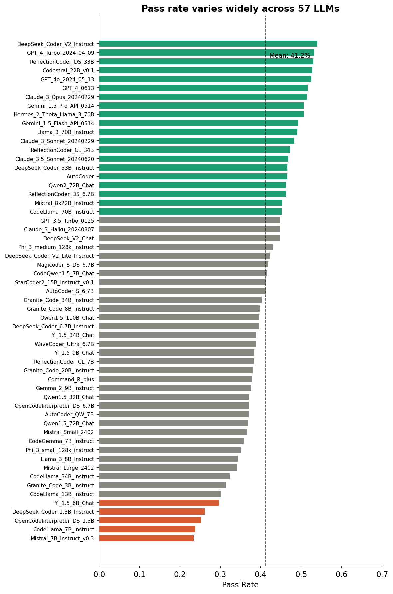
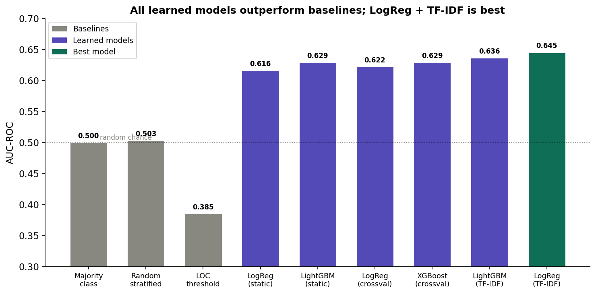
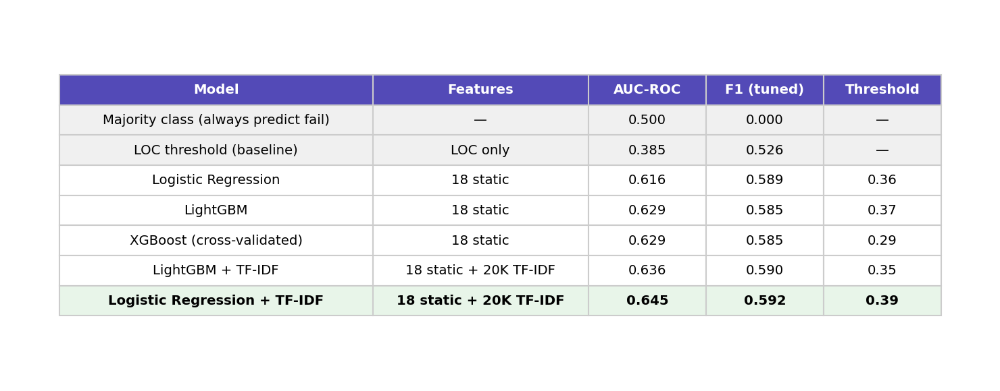
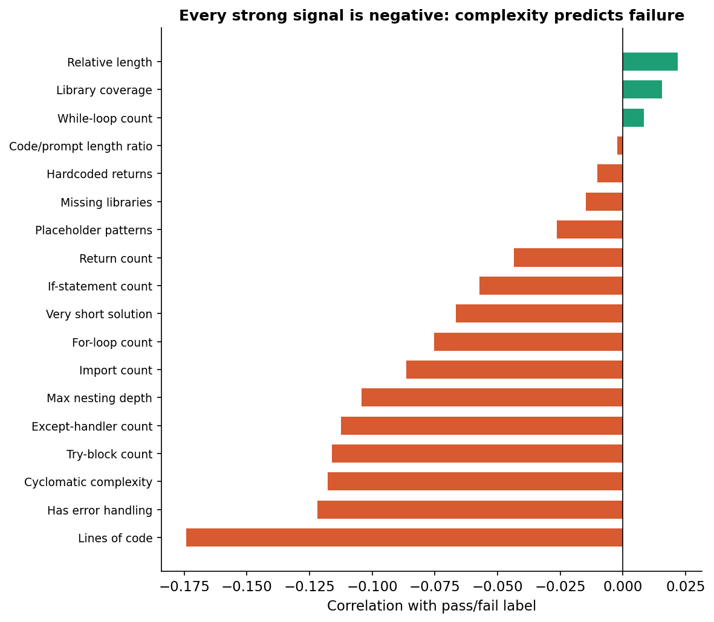

# IDS 705 Final Report

# Vibe Check: Static Defect Prediction for AI-Generated Code

**Team Members:**
Jordan Andrew
Vihaan Manchanda
Yuqian Wang
Qingyu "Grace" Yang
Xihan "Patrick" Zhu

**Team Identifier:** [your team number]

**Target stakeholder(s) for this report:** Engineering leads at mid-to-large companies that have adopted AI coding assistants (e.g., GitHub Copilot, Cursor, Claude Code). These are technical managers responsible for code quality and testing strategy who are deciding how to integrate AI-generated code into their review pipelines. They have a software engineering background but are not ML specialists.

## Executive Summary

AI coding assistants are now standard tools on most engineering teams, but they produce code that fails its tests roughly 40 to 60 percent of the time on real-world tasks. Right now, the only way to catch these failures is to run the code against a test suite, which takes time, compute, and assumes good tests exist in the first place. We investigated whether it is possible to flag likely-broken AI-generated code using only static analysis, before running anything.

We trained classifiers on 123,000 labeled code samples from 57 different LLMs using the BigCodeBench benchmark. Our best model, a logistic regression trained on code metrics and text features, catches failures better than chance (0.645 AUC-ROC, 0.592 F1) but is far from a replacement for testing. The core finding is that AI code fails for reasons that are mostly invisible to static analysis. Passing and failing code look almost identical structurally, differing by about 96 characters on average. The real signal is task difficulty, not code quality: hard tasks trip up strong and weak models alike.

**Decisions to be made:**

- **Should we deploy this as a triage filter?** The model is good enough to prioritize which AI outputs get reviewed first, but not good enough to skip testing. We recommend using it to rank outputs by risk, not to approve or reject them.
- **Is it worth investing in better static predictors?** Probably not. Our analysis shows static features have hit their ceiling on this problem. Passing and failing code are structurally near-identical. Meaningful improvement would require semantic code understanding, such as code embeddings from pretrained models like CodeBERT, which is a different kind of investment entirely.

## Report

### Problem

AI coding assistants have become a default part of the development workflow. To assess their reliability, we used BigCodeBench, a benchmark comprising 1,140 practical Python programming tasks. A task is a natural language prompt that asks the model to write a function, for example "write a function that reads a CSV file, filters rows where the price column exceeds a threshold, and returns the result as a pandas DataFrame." In BigCodeBench, each task is given to 57 different LLMs, and each generated solution is executed against a test suite and labeled as either pass or fail. Even the best-performing model in this benchmark (DeepSeek Coder V2) only passes 54% of the time. The average across all 57 models is 41%. The worst sits at around 15%.

These tasks are representative of real engineering work. They involve composing library calls across pandas, requests, subprocess, and similar packages, the kind of code that shows up every day in production codebases. Figure 1 shows how pass rates spread across the 57 models we studied.

*Figure 1. Pass rates across 57 LLMs on BigCodeBench. The mean is 41%. Even the best model fails nearly half the time, and the worst fails over 80% of the time.*

The scale of the problem is clear: teams adopting AI coding assistants are accepting outputs that fail more often than they succeed, and the failure rate varies dramatically depending on which model they use.

### Current Solutions

Right now, the workflow looks like this: accept an AI-generated output, write or run tests, discover it's broken, iterate. There's no pre-screening step. Every output gets the same treatment regardless of how likely it is to be correct.

For teams generating dozens or hundreds of AI outputs a day, this is expensive. Some teams skip testing entirely for outputs that "look right," which is how bugs ship. The missing piece is a lightweight signal that says "this one is probably fine" or "this one deserves a closer look" before any tests are written or run.

### Our Approach

We asked whether it is possible to predict if AI-generated code will fail using only static properties of the code itself, without executing it.

We extracted 18 static features from each code sample, including lines of code, cyclomatic complexity, whether the required libraries are actually imported, and patterns we call "LLM smells" such as placeholder code, hardcoded returns, and suspiciously short functions. We also extracted text patterns from the raw code using TF-IDF. We then trained classifiers on 123,000 labeled samples and tuned decision thresholds on a held-out validation set. The full details of our experimental setup are in the Methods appendix.

### Results

Figure 2 compares all models we trained against the baselines on AUC-ROC, a metric that measures how well the model separates passing code from failing code regardless of the decision threshold.

*Figure 2. AUC-ROC across all models. Gray bars are baselines (no learning). Purple bars are learned models. Green is the best performer. All learned models beat baselines. Logistic Regression with TF-IDF features achieves the highest AUC at 0.645.*

Every learned model outperforms the baselines. The best model, logistic regression trained on 18 static features plus 20,000 TF-IDF text features, achieves 0.645 AUC-ROC and 0.592 F1 after threshold tuning. Table 1 has the full numbers.

*Table 1. Model performance on the held-out test set. All learned models shown with threshold-tuned F1 (thresholds selected on validation set). Baselines shown in gray, best model highlighted in green.*

To put 0.645 AUC in practical terms: given a random passing sample and a random failing sample, the model correctly identifies which is which about 65% of the time. That is meaningfully better than a coin flip, but it is not a safety net. For comparison, the same type of static defect prediction on human-written code typically achieves 0.70 to 0.80 AUC. Our lower number is not a modeling failure. It reflects a genuinely harder problem, which brings us to the most important finding.

### Why It Works (and Why It Doesn't Work Better)

The features that carry predictive signal are all complexity proxies. Figure 3 shows how each feature correlates with the pass/fail label.

*Figure 3. Correlation of each static feature with the pass/fail label. Every strong signal (red) is negative: more complexity predicts more failure. Prompt-alignment features (green, near zero) carry almost no signal.*

Lines of code, cyclomatic complexity, import counts, and nesting depth all correlate negatively with passing. Longer, more complex code is more likely to fail. However, the issue is that these features are really measuring how hard the task is, not how good the code is. Harder tasks require longer solutions from every model, and every model fails more on harder tasks.

This becomes clear when looking at the failure patterns directly. Passing and failing code differ by an average of just 96 characters and 1.6 lines. Two solutions can have the same imports, the same control flow, the same structure, and differ only in a single method call, `.mean()` instead of `.sum()`, and no static feature can detect that.

The overlap between models makes the same point from a different angle. The top-5 and bottom-5 performing models fail on 77% of the same tasks. Of the 1,140 tasks in the benchmark, 153 are so hard that all 57 models fail. Our classifier ends up predicting "how hard is this task" more than "is this specific code correct." That's useful for prioritization, but it has a hard ceiling.

### Recommendations

Given these findings, we recommend two things for deploying the classifier:

1. **Use the classifier as a triage filter, not a gate.** At 0.645 AUC, the model can rank AI outputs by predicted risk so reviewers focus on the most suspect ones first. It should not be used to approve or reject code outright since it gets things wrong too often for that. The value is in prioritization: teams can direct limited review time toward the outputs the classifier flags as highest risk, rather than treating every output equally.

2. **Invest in semantic code analysis for meaningful improvement.** Static features have reached their ceiling on this problem at 0.645 AUC. Our feature engineering was extensive, covering 18 hand-crafted features across four groups plus 20,000 TF-IDF text features, and further additions are unlikely to move the needle. Passing and failing code are structurally near-identical, so the next step forward would require models that understand what the code actually does, such as code embeddings from pretrained models like CodeBERT.

## Required Appendices

### Background and Related Work

AI coding assistants now produce a significant share of new code in industry, yet even frontier models solve only about 60% of practical tasks (Zhuo et al., 2024). Developers accept and ship these outputs with limited testing. The question we address is whether static analysis of AI-generated code can predict which outputs will fail before they reach production.

Software defect prediction (SDP) has studied this kind of problem for human-written code over two decades. The core approach is to extract static features from source code and train classifiers to predict bugs without running anything. Early work by Menzies et al. (2007) used lines of code, cyclomatic complexity, and module coupling with classical classifiers. Khalid et al. (2023) found that even basic methods like SVMs remain competitive on standard defect datasets. More recent deep learning approaches operating on ASTs and code token sequences have pushed performance further (Akimova et al., 2021; Giray et al., 2023), though Abdu et al. (2022) noted that traditional metrics still miss important semantic differences between code regions. Typical AUC values for within-project SDP on human code range from 0.70 to 0.80 with hand-crafted features, up to 0.85 with deep learning (Giray et al., 2023).

A persistent challenge in SDP is cross-project generalization. Zou et al. (2025) documented performance drops of 0.05 to 0.15 AUC when transferring models across codebases. Herbold et al. (2022) found in a meta-analysis of 78 studies that no single method consistently dominates in the cross-project setting. This matters for our work because predicting on unseen tasks is structurally similar to cross-project prediction.

All of this prior work targets human-written code. LLM-generated code is a fundamentally different setting. Human bugs tend to concentrate in complex, frequently-changed modules, which is why process metrics like change frequency and developer count are among the strongest SDP predictors (Hassan, 2009; Moser et al., 2008; Kamei et al., 2013). AI-generated code has no edit history, no developers, and no prior versions, so these signals are simply unavailable. Recent studies have begun characterizing how LLM code fails: Pendyala and Thakur (2025) found language-specific failure patterns and that LLMs drift from the prompt as code grows longer. Zhong and Wang (2024) found widespread API misuse in LLM outputs. Liu et al. (2023) showed that many LLM solutions passing basic tests fail under rigorous testing. Chen et al. (2021) established that code generation accuracy scales with model size but plateaus below human performance.

These studies measure how often LLMs fail. None address whether we can predict *which specific outputs* will fail from the code alone. That is the gap we address.

Our design choices follow from this literature. We chose logistic regression for its strong SDP track record and interpretability (Khalid et al., 2023), and gradient-boosted trees for tabular data performance. We split by task ID to mirror the cross-project protocol recommended by Zou et al. (2025). We designed LLM-specific features motivated by the failure analyses of Pendyala and Thakur (2025) and Zhong and Wang (2024). We added TF-IDF features because structural metrics alone miss semantic signals (Abdu et al., 2022).

**References**

[1] Zhuo, T. Y., Vu, M. C., Chim, J., et al. (2024). BigCodeBench: Benchmarking Code Generation with Diverse Function Calls and Complex Instructions. *ICLR 2025*. arXiv:2406.15877.

[2] Khalid, A., Badshah, G., Ayub, N., Shiraz, M., & Ghouse, M. (2023). Software Defect Prediction Analysis Using Machine Learning Techniques. *Sustainability*, 15(6), 5517.

[3] Zou, Y., Wang, H., Lv, H., & Zhao, S. (2025). Deep Learning-Based Cross-Project Defect Prediction: A Comprehensive Survey. *QRS-C 2025*.

[4] Abdu, A., Zhai, Z., Algabri, R., Abdo, H. A., Hamad, K., & Al-antari, M. A. (2022). Deep Learning-Based Software Defect Prediction via Semantic Key Features of Source Code: Systematic Survey. *Mathematics*, 10, 3120.

[5] Pendyala, V. S., & Thakur, N. (2025). An Analysis of LLM Code Generation Across Programming Languages. *arXiv preprint*.

[6] Liu, J., Xia, C. S., Wang, Y., & Zhang, L. (2023). Is Your Code Generated by ChatGPT Really Correct? *NeurIPS 2023*.

[7] Zhong, L., & Wang, Z. (2024). Can LLM Replace Stack Overflow? A Study on Robustness and Reliability of Large Language Model Code Generation. *AAAI 2024*, 21841-21849.

[8] Akimova, E. N., Bersenev, A. Y., Deikov, A. A., et al. (2021). A Survey on Software Defect Prediction Using Deep Learning. *Mathematics*, 9(11), 1180.

[9] Giray, G., Bennin, K. E., Koksal, O., Babur, O., & Tekinerdogan, B. (2023). On the use of deep learning in software defect prediction. *Journal of Systems and Software*, 195.

[10] Menzies, T., Greenwald, J., & Frank, A. (2007). Data Mining Static Code Attributes to Learn Defect Predictors. *IEEE Transactions on Software Engineering*, 33(1), 2-13.

[11] Hassan, A. E. (2009). Predicting faults using the complexity of code changes. *Proceedings of the 31st International Conference on Software Engineering*, 78-88.

[12] Moser, R., Pedrycz, W., & Succi, G. (2008). A comparative analysis of the efficiency of change metrics and static code attributes for defect prediction. *Proceedings of the 30th International Conference on Software Engineering*, 181-190.

[13] Chen, M., Tworek, J., Jun, H., et al. (2021). Evaluating Large Language Models Trained on Code. *arXiv:2107.03374*.

[14] Kamei, Y., Shihab, E., Adams, B., Hassan, A. E., Mockus, A., Sinha, A., & Ubayashi, N. (2013). A Large-Scale Empirical Study of Just-in-Time Quality Assurance. *IEEE Transactions on Software Engineering*, 39(6), 757-773.

[15] Herbold, S., Trautsch, A., & Grabowski, J. (2022). A systematic mapping study of cross-project defect prediction. *Information and Software Technology*, 145, 106792.

### Methods and Experimental Design

The overall experimental pipeline is shown in Figure 5. We describe each stage below with the rationale for our choices.

```mermaid
flowchart LR
    subgraph DATA["Data"]
        A["BigCodeBench\n123K samples, 57 LLMs"]
    end

    subgraph PREP["Preprocessing"]
        TR["Train 70%"]
        VA["Val 15%"]
        TE["Test 15%\n(withheld)"]
    end

    subgraph FEAT["Feature Engineering"]
        F1["Classical Metrics (3)"]
        F2["AST Structure (8)"]
        F3["Prompt Alignment (3)"]
        F4["LLM Smells (4)"]
    end

    subgraph MODEL["Modeling"]
        H["Baselines"]
        I["LogReg + LightGBM\n(18 static features)"]
        J["LogReg + LightGBM\n(18 static + 20K TF-IDF)"]
        K["LogReg + XGBoost\n(5-fold GroupKFold CV)"]
    end

    subgraph TUNE["Threshold Tuning\n(on val set only)"]
        L["Sweep 0.10–0.90\nmaximize F1"]
    end

    subgraph EVAL["Final Evaluation\n(test set, used once)"]
        M["AUC-ROC, F1, Accuracy"]
    end

    DATA --> PREP --> FEAT --> MODEL --> TUNE --> EVAL
```

*Figure 5. Experimental pipeline. All model training uses the training set. Hyperparameter and threshold decisions use the validation set. The test set is used exactly once for final evaluation.*

**Data.** We use BigCodeBench (Zhuo et al., 2024), which pairs 1,140 Python tasks with code generated by 57 LLMs. Each task has a natural language prompt, a canonical solution, and a test suite averaging 5.6 test cases at 99% branch coverage. The tasks span 139 libraries across data analysis, web development, scientific computing, and file processing. Each sample is one model's attempt at one task, labeled pass or fail from running the tests. After matching samples to labels, the dataset has 123,416 samples with a 41% pass rate. We chose BigCodeBench because it's the largest public dataset of LLM-generated code with ground-truth labels, and its multi-library tasks better reflect real coding than single-function benchmarks like HumanEval.

**Splitting.** We split 70/15/15 grouped by task ID, so the same programming problem never appears in multiple sets. This forces classifiers to generalize to unseen tasks rather than memorize task-specific patterns. The SDP literature has shown that random splits inflate performance (Zou et al., 2025), and grouping by task mirrors the cross-project evaluation that the field recommends.

**Feature extraction.** We extract 18 static features per sample using Python's `ast` module and the `radon` library, organized into four groups:

- *Classical metrics (3):* lines of code, cyclomatic complexity, max nesting depth. These are the standard SDP features used for decades on human code (Menzies et al., 2007) and serve as our baseline for comparing AI-code patterns against established findings.
- *AST structure (8):* counts of if/for/while/try/except/return/import nodes, plus an error-handling flag. These capture control flow at a finer granularity than classical metrics.
- *Prompt-code alignment (3):* fraction of required libraries imported, count of missing libraries, code-to-prompt length ratio. These are LLM-specific. We designed them based on findings that LLMs drift from the prompt as code grows (Pendyala & Thakur, 2025). We parse required libraries from BigCodeBench metadata rather than scanning prompt text.
- *LLM smells (4):* hardcoded-return functions, placeholder patterns (pass, ellipsis, NotImplementedError, TODO), a very-short flag, and relative length vs. task median. These target known LLM failure modes documented by Zhong and Wang (2024).

**Baselines.** We first establish four non-learned baselines: majority class, random stratified, code-length threshold, and LOC threshold. These confirm that learned models capture real signal.

**Classification models.** We train three modeling approaches, each exploring a different angle of the problem.

The first approach (baseline) trains logistic regression and LightGBM on the 18 static features alone. We chose logistic regression because it has a strong track record in SDP (Khalid et al., 2023), its coefficients are directly interpretable, and it provides a stable baseline unlikely to overfit. We chose LightGBM because gradient-boosted trees consistently rank among the top performers on tabular classification tasks and can capture nonlinear feature interactions that logistic regression cannot. Logistic regression uses balanced class weights and is tuned over regularization strength C. LightGBM is tuned over the number of estimators, learning rate, and maximum tree depth, with early stopping on the validation set and class imbalance handled via scale_pos_weight.

The second approach (TF-IDF) extends the baseline by adding TF-IDF features extracted from the raw code text. We fit two vectorizers on the training set only: a word-level vectorizer capturing code identifiers and keywords (10,000 features), and a character-level vectorizer capturing syntax patterns (10,000 features). Combined with the 18 static features, this yields 20,018 total features. The motivation comes from Abdu et al. (2022), who argued that traditional software metrics miss important semantic differences between code regions. TF-IDF gives the models access to the actual code tokens rather than just summary statistics, potentially capturing patterns like specific function names or import sequences that correlate with correctness. Logistic regression and LightGBM are trained on this combined representation.

The third approach (cross-validation) trains logistic regression and XGBoost on the 18 static features using 5-fold StratifiedGroupKFold cross-validation grouped by task ID for hyperparameter tuning. We included this approach because it provides a more rigorous estimate of generalization performance than simple validation-set tuning, and because StratifiedGroupKFold maintains both class balance and task separation within each fold. We added XGBoost because it is one of the most widely used classifiers in applied ML and allows us to compare against LightGBM under different boosting implementations. The final logistic regression model is retrained on the combined training and validation sets before test evaluation.

**Threshold tuning.** The 41/59 class split makes the default 0.5 threshold a poor choice. We sweep thresholds 0.10 to 0.90 on the validation set and pick the one maximizing F1. This step proved critical. It had a bigger impact on F1 than switching model architectures.

**Evaluation.** We report AUC-ROC (threshold-independent, primary metric), F1 (balances precision and recall for the imbalanced classes), and accuracy. The test set is used once per model.

### Ethical Considerations

A static defect predictor for AI-generated code carries real risks if deployed carelessly.

The biggest risk is false confidence. If developers treat a "low risk" prediction as a green light to skip testing, they will ship broken code. Our best model sits at 0.645 AUC, which means it makes substantial errors in both directions. This is especially dangerous because developers already tend to over-trust AI coding assistants. Layering a second AI assessment on top could compound the problem. Any deployment needs to frame predictions as risk estimates, not verdicts, and should never be positioned as a replacement for tests.

The model also performs unevenly across task types. Code involving system libraries fails much more often than code using standard utilities, so the model will systematically flag certain domains more than others. Teams should understand that flagging rates reflect task difficulty as much as code quality.

There are no meaningful privacy concerns. All data is from BigCodeBench, publicly available under Apache 2.0. The code samples are LLM-generated, not written by individuals. Our pipeline is fully open-source.

A broader concern: if teams use defect prediction scores to evaluate AI coding tools, models from smaller open-source projects (which tend to have lower pass rates) could be unfairly penalized relative to proprietary models. The scores reflect task difficulty as much as model capability, and shouldn't be used to make blanket judgments about specific providers.

### Roles

**Jordan Andrew:** Model training and evaluation. Built the baseline and TF-IDF modeling pipelines (`train_baseline.py`, `train_tfidf.py`). Implemented hyperparameter tuning with validation-set evaluation for logistic regression and LightGBM. Generated SHAP feature importance analysis and precision-recall curve visualizations.

**Vihaan Manchanda:** Data collection, feature engineering, and repository infrastructure. Built the data collection pipeline (`collect_data.py`) including the model name normalization and sample-label matching logic. Designed and implemented all four feature extraction groups (`feature_extraction.py`). Set up the repository structure, `main.py` orchestrator, and baseline comparisons. Conducted the failure analysis. Wrote the Background and Related Work and Methods sections.

**Yuqian Wang:** Feature extraction support and exploratory analysis. Assisted with classical metrics and AST feature implementation. Conducted EDA on label distributions, model performance comparisons, and solution characteristics. Created report figures.

**Qingyu "Grace" Yang:** Cross-validation framework and model selection. Built the cross-validation pipeline (`train_crossval.py`) using StratifiedGroupKFold grouped by task ID. Trained and compared logistic regression and XGBoost with rigorous hyperparameter tuning. Conducted the analysis selecting logistic regression as the final model based on stability and F1. Implemented threshold tuning (`tune_threshold.py`).

**Xihan "Patrick" Zhu:** Literature review and interpretability analysis. Conducted the background literature review across SDP and LLM evaluation research. Performed SHAP analysis comparing feature importance patterns between AI code and findings from the human-code SDP literature.
