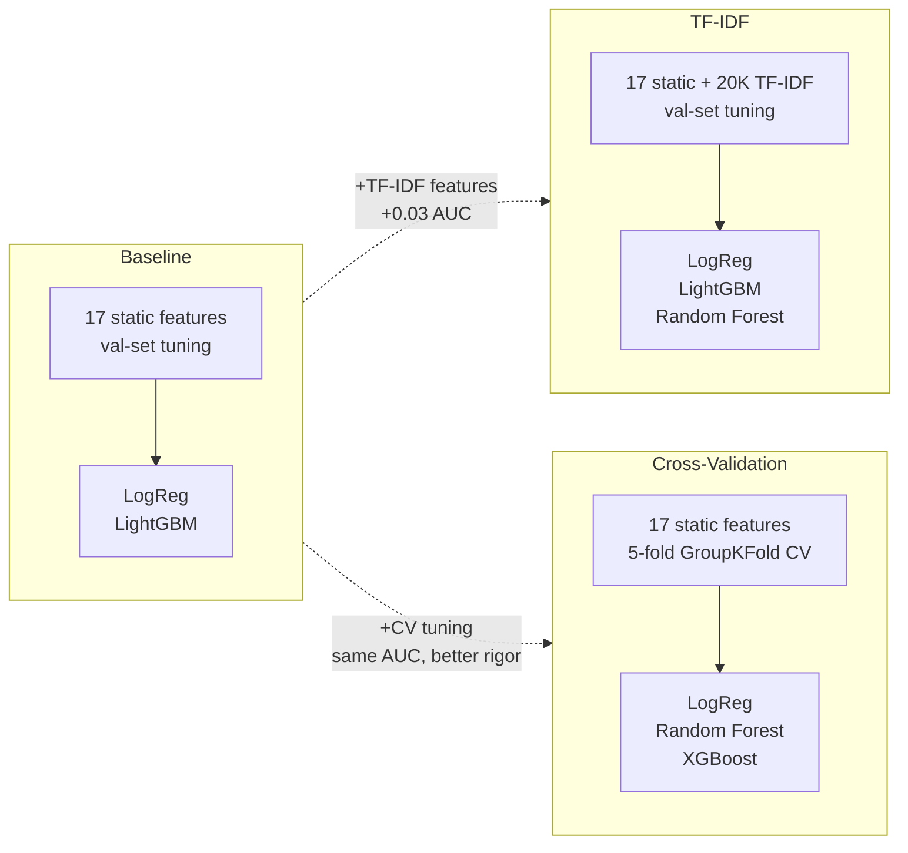

# Models

Binary classification: given a code sample and its static features, predict whether it passes its test suite (label=1) or fails (label=0).

Three modeling approaches were tried, each exploring a different angle. All use the same train/val/test split (70/15/15, grouped by task_id).




## Baseline: Static Features, Validation-Set Tuning

**Script**: `train_baseline.py`

Trains on the 17 hand-crafted features from feature extraction. This is the starting point to see how far classical software metrics, AST structure, prompt alignment, and LLM smell features can take us. Hyperparameters are tuned by evaluating on the validation set.

**Logistic Regression**: StandardScaler pipeline, LBFGS solver, balanced class weights. C tuned over {0.001, 0.01, 0.1, 1, 10, 100}.

**LightGBM**: n_estimators over {200, 500}, learning_rate over {0.05, 0.1}, max_depth over {4, 7}. Early stopping with 50-round patience. Class imbalance handled via scale_pos_weight (~1.48).

### Test set results

| Model | AUC-ROC | F1 | Accuracy | Precision (pass) | Recall (pass) |
|---|---|---|---|---|---|
| Logistic Regression | 0.604 | 0.538 | 0.561 | 0.475 | 0.621 |
| LightGBM | 0.608 | 0.516 | 0.582 | 0.493 | 0.541 |

### Outputs (in `outputs_baseline/`)

| File | Description |
|---|---|
| `logreg_model.pkl` | Trained Logistic Regression pipeline |
| `lgbm_model.pkl` | Trained LightGBM model |
| `metrics.txt` | AUC, F1, and full classification reports |
| `results.csv` | Test set predictions and probabilities per sample |
| `logreg_coefs.png` | Feature weight chart |
| `lgbm_shap.png` | SHAP feature importance for LightGBM |
| `pr_curves.png` | Precision-recall curves |


## TF-IDF: Static + Code Text Features, Validation-Set Tuning

**Script**: `train_tfidf.py`

Extends the baseline by adding TF-IDF features extracted directly from the raw generated code. This gives models access to actual code tokens (function names, keywords, syntax patterns) rather than just summary statistics.

Two TF-IDF vectorizers are fit on the training set only (no data leakage):
- Word-level (1-2 grams, 10,000 features): captures identifiers like `pd`, `json_normalize`, `DataFrame`
- Character-level (2-4 grams, 10,000 features): captures syntax like `def `, `try:`, `return`

Combined with the 17 static features, this gives 20,017 total features.

**Logistic Regression**: SAGA solver (efficient for large sparse matrices), C tuned over {0.01, 0.1, 1, 10}.

**LightGBM**: colsample_bytree lowered to 0.3 (since most features are TF-IDF), n_estimators over {300, 500}, learning_rate over {0.05, 0.1}.

**Random Forest**: Uses only the 17 static features (RF on 20K sparse TF-IDF columns is prohibitively slow). n_estimators over {200, 500}, max_depth over {8, 15, None}.

### Test set results

| Model | Features | AUC-ROC | F1 | Accuracy | Precision (pass) | Recall (pass) |
|---|---|---|---|---|---|---|
| Logistic Regression | Static + TF-IDF | 0.635 | 0.537 | 0.592 | 0.504 | 0.574 |
| LightGBM | Static + TF-IDF | 0.634 | 0.529 | 0.611 | 0.528 | 0.530 |
| Random Forest | Static only | 0.605 | 0.537 | 0.581 | 0.493 | 0.591 |

Adding TF-IDF improved AUC by about 0.03 for Logistic Regression and LightGBM.

### Outputs (in `outputs_tfidf/`)

| File | Description |
|---|---|
| `logreg_model.pkl` | Trained Logistic Regression |
| `lgbm_model.pkl` | Trained LightGBM |
| `rf_model.pkl` | Trained Random Forest |
| `word_tfidf.pkl` | Fitted word-level TF-IDF vectorizer |
| `char_tfidf.pkl` | Fitted character-level TF-IDF vectorizer |
| `metrics.txt` | AUC, F1, and full classification reports |
| `results.csv` | Test set predictions and probabilities per sample |
| `feature_importance.png` | Top TF-IDF tokens by logistic regression coefficient |
| `pr_curves.png` | Precision-recall curves for all three models |


## Cross-Validation: Static Features, StratifiedGroupKFold Tuning

**Script**: `train_crossval.py`

Uses the same 17 static features as the baseline but with a more rigorous tuning approach: 5-fold StratifiedGroupKFold cross-validation grouped by task_id. This prevents any task from appearing in both the train and validation folds during CV, matching the evaluation protocol recommended in the SDP literature.

**Logistic Regression**: GridSearchCV over C in {0.01, 0.1, 1, 10}, with SimpleImputer (median) + StandardScaler pipeline. Best: C=0.01, CV AUC=0.631. The final model is retrained on train+val before test evaluation.

**XGBoost**: RandomizedSearchCV (20 iterations) over n_estimators, max_depth, learning_rate, subsample, colsample_bytree, min_child_weight, gamma, reg_lambda, reg_alpha. Best CV AUC=0.634.

**Random Forest**: 400 estimators, min_samples_leaf=2, balanced_subsample class weights. Not CV-tuned (default config).

### Validation results (before test)

| Model | Train AUC | Val AUC | Val F1 | Overfitting |
|---|---|---|---|---|
| Logistic Regression | 0.638 | 0.637 | 0.596 | None |
| XGBoost (default) | 0.794 | 0.609 | 0.396 | Significant |
| XGBoost (tuned) | 0.664 | 0.640 | 0.329 | Moderate |
| Random Forest | 0.976 | 0.584 | 0.433 | Severe |

Logistic Regression is the only model with nearly identical train and validation performance. XGBoost's tuning improved AUC but collapsed F1 due to very low recall (0.23). Random Forest massively overfits.

### Test set results

| Model | AUC-ROC | F1 | Accuracy | Precision (pass) | Recall (pass) |
|---|---|---|---|---|---|
| Logistic Regression | 0.608 | 0.536 | 0.561 | 0.474 | 0.615 |
| XGBoost (tuned) | 0.640 | 0.329 | 0.581 | 0.579 | 0.230 |
| Random Forest | 0.584 | 0.433 | 0.571 | -- | -- |

Logistic Regression was selected as the final model: best F1, most stable, and most interpretable.

### Outputs (in `outputs_crossval/`)

| File | Description |
|---|---|
| `logreg_model.pkl` | Trained Logistic Regression (retrained on train+val) |
| `xgb_model.pkl` | Trained XGBoost |
| `rf_model.pkl` | Trained Random Forest |
| `metrics.txt` | AUC, F1, and full classification reports |
| `results.csv` | Test set predictions and probabilities per sample |
| `pr_curves.png` | Precision-recall curves |


## Feature Importance

The most predictive static features across all approaches:

| Feature | Correlation with label | Interpretation |
|---|---|---|
| `classical_loc` | -0.174 | Longer code is more likely to fail |
| `ast_has_error_handling` | -0.122 | Tasks needing try/except are harder |
| `classical_cyclomatic_complexity` | -0.118 | More branching logic correlates with failure |
| `ast_try_count` | -0.116 | Same pattern as error handling |
| `classical_max_nesting_depth` | -0.104 | Deeper nesting correlates with failure |
| `ast_import_count` | -0.086 | More imports suggests a harder task |

All negative correlations. Complexity proxies for task difficulty, and LLMs fail more on harder tasks.

Prompt-code alignment features (`align_lib_coverage`, `align_missing_libs`, `align_length_ratio`) all show near-zero correlation. LLMs rarely forget to import libraries; they fail in subtler ways.


## Class Imbalance

The dataset is 41% pass / 59% fail. All models use class weighting:
- Logistic Regression and Random Forest: `class_weight="balanced"` (or `balanced_subsample`)
- LightGBM: `scale_pos_weight` = negative/positive ratio (~1.48)
- XGBoost: default (no explicit weighting in the crossval approach)

We evaluate with AUC-ROC and F1 rather than accuracy. A majority-class baseline would get 59% accuracy but 0.0 F1 on the positive class.


## How to Run

```bash
python main.py --models              # train all three
python main.py --models baseline     # static features, val-set tuning
python main.py --models tfidf        # static + TF-IDF, val-set tuning
python main.py --models crossval     # static features, GroupKFold CV

# or directly
python models/train_baseline.py
python models/train_tfidf.py
python models/train_crossval.py
```

All scripts expect split CSVs at `data/clean/splits/`. Run `python main.py --preprocess --features` first if they don't exist.
