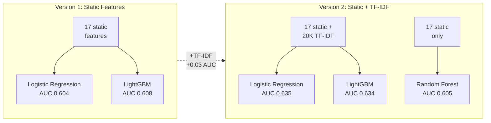

# Models

Binary classification: given a code sample and its static features, predict whether it passes its test suite (label=1) or fails (label=0).

Two model versions were trained, each building on the previous one. Both tune hyperparameters on the validation set and evaluate once on the held-out test set.




## Version 1: Static Features Only

**Script**: `train_models_v1.py`

Trains on the 17 hand-crafted features from feature extraction. This is the baseline to see how far classical software metrics, AST structure, prompt alignment, and LLM smell features can take us.

**Logistic Regression**: StandardScaler pipeline, LBFGS solver, balanced class weights. Regularization strength C tuned over {0.001, 0.01, 0.1, 1, 10, 100}.

**LightGBM**: n_estimators tuned over {200, 500}, learning_rate over {0.05, 0.1}, max_depth over {4, 7}. Early stopping on validation set with 50-round patience. Class imbalance handled via scale_pos_weight (~1.48).

### Test set results

| Model | AUC-ROC | F1 | Accuracy | Precision (pass) | Recall (pass) |
|---|---|---|---|---|---|
| Logistic Regression | 0.604 | 0.538 | 0.561 | 0.475 | 0.621 |
| LightGBM | 0.608 | 0.516 | 0.582 | 0.493 | 0.541 |

Logistic Regression has higher recall for the positive class (correctly identifying passing code), while LightGBM has higher overall accuracy but lower F1.

### Outputs (in `outputs_v1/`)

| File | Description |
|---|---|
| `logreg_model.pkl` | Trained Logistic Regression pipeline |
| `lgbm_model.pkl` | Trained LightGBM model |
| `metrics.txt` | AUC, F1, and full classification reports |
| `results.csv` | Test set predictions and probabilities per sample |
| `logreg_coefs.png` | Feature weight chart |
| `lgbm_shap.png` | SHAP feature importance for LightGBM |
| `pr_curves.png` | Precision-recall curves |


## Version 2: Static Features + TF-IDF

**Script**: `train_models_v2.py`

Extends v1 by adding TF-IDF features extracted directly from the raw generated code. This gives models access to actual code tokens (function names, keywords, syntax patterns) rather than just summary statistics.

Two TF-IDF vectorizers are fit on the training set only (no data leakage):
- Word-level (1-2 grams, 10,000 features): captures identifiers like `pd`, `json_normalize`, `DataFrame`
- Character-level (2-4 grams, 10,000 features): captures syntax like `def `, `try:`, `return`

Combined with the 17 static features, this gives 20,017 total features.

**Logistic Regression**: SAGA solver (efficient for large sparse matrices), C tuned over {0.01, 0.1, 1, 10}.

**LightGBM**: colsample_bytree lowered to 0.3 (since most features are TF-IDF), n_estimators tuned over {300, 500}, learning_rate over {0.05, 0.1}.

**Random Forest**: Uses only the 17 static features (RF on 20K sparse TF-IDF columns is prohibitively slow). n_estimators tuned over {200, 500}, max_depth over {8, 15, None}.

### Test set results

| Model | Features | AUC-ROC | F1 | Accuracy | Precision (pass) | Recall (pass) |
|---|---|---|---|---|---|---|
| Logistic Regression | Static + TF-IDF | 0.635 | 0.537 | 0.592 | 0.504 | 0.574 |
| LightGBM | Static + TF-IDF | 0.634 | 0.529 | 0.611 | 0.528 | 0.530 |
| Random Forest | Static only | 0.605 | 0.537 | 0.581 | 0.493 | 0.591 |

Adding TF-IDF improved AUC by about 0.03 for Logistic Regression and LightGBM. LightGBM has the highest accuracy (0.611) but Logistic Regression has the best AUC (0.635).

### Outputs (in `outputs_v2/`)

| File | Description |
|---|---|
| `logreg_model.pkl` | Trained Logistic Regression |
| `lgbm_model.pkl` | Trained LightGBM |
| `rf_model.pkl` | Trained Random Forest |
| `word_tfidf.pkl` | Fitted word-level TF-IDF vectorizer |
| `char_tfidf.pkl` | Fitted character-level TF-IDF vectorizer |
| `metrics.txt` | AUC, F1, and full classification reports |
| `results.csv` | Test set predictions and probabilities per sample |
| `feature_importance.png` | Top TF-IDF tokens by logistic regression coefficient |
| `pr_curves.png` | Precision-recall curves for all three models |


## Feature Importance

The most predictive static features across both versions:

| Feature | Correlation with label | Interpretation |
|---|---|---|
| `classical_loc` | -0.174 | Longer code is more likely to fail |
| `ast_has_error_handling` | -0.122 | Tasks needing try/except are harder |
| `classical_cyclomatic_complexity` | -0.118 | More branching logic correlates with failure |
| `ast_try_count` | -0.116 | Same pattern as error handling |
| `classical_max_nesting_depth` | -0.104 | Deeper nesting correlates with failure |
| `ast_import_count` | -0.086 | More imports suggests a harder task |

All negative correlations. The pattern is clear: complexity proxies for task difficulty, and LLMs fail more on harder tasks. Simple tasks get correct short answers; harder tasks produce longer but incorrect code.

Prompt-code alignment features (`align_lib_coverage`, `align_missing_libs`, `align_length_ratio`) all show near-zero correlation. This was a surprising finding since we hypothesized that missing library imports would be a strong failure signal. In practice, LLMs rarely forget to import libraries; they fail in subtler ways.


## Class Imbalance

The dataset is 41% pass / 59% fail. All models use class weighting to avoid defaulting to the majority class:
- Logistic Regression and Random Forest: `class_weight="balanced"`
- LightGBM: `scale_pos_weight` = negative/positive ratio (~1.48)

We evaluate with AUC-ROC and F1 rather than accuracy. A majority-class baseline would get 59% accuracy but 0.0 F1 on the positive class.


## How to Run

```bash
python main.py --models          # train both versions
python main.py --models v1       # static features only
python main.py --models v2       # static + TF-IDF

# or directly
python models/train_models_v1.py
python models/train_models_v2.py
```

Both scripts expect split CSVs to exist at `data/clean/splits/`. Run `python main.py --preprocess --features` first if they do not.
